# snowflake_project
This project showcases medallion architecture. The project is done using local airflow setup with snowflake. The pipeline starts by  a csv file into the bronze layer, cleans it and then loads it to the silver layer, and finally to the gold where it is ready for reporting. You can find the ddl scripts, time travel, and procedures used in snowflake for this project in the snowflake folder.

## Prerequisites
.env file containing the following: 
* AIRFLOW_UID=50000 
* _PIP_ADDITIONAL_REQUIREMENTS=apache-airflow-providers-snowflake

## Airline Dashboard
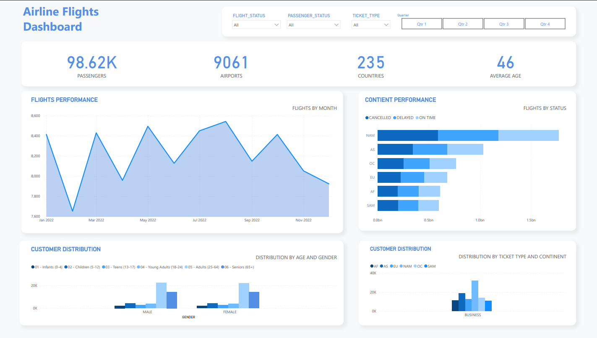

## Airflow Dag
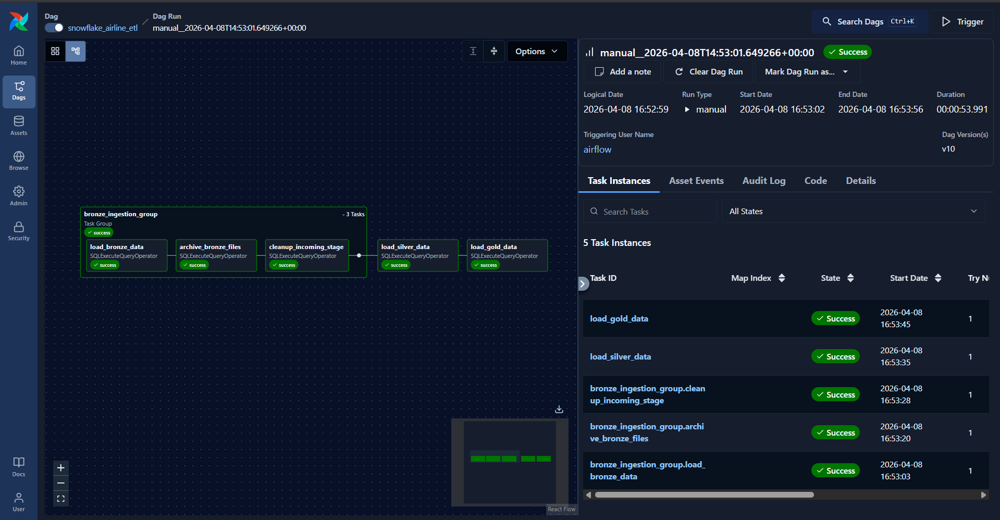

## Snowflake
### Bronze Layer
This layer is a 1-to-1 copy of the dataset
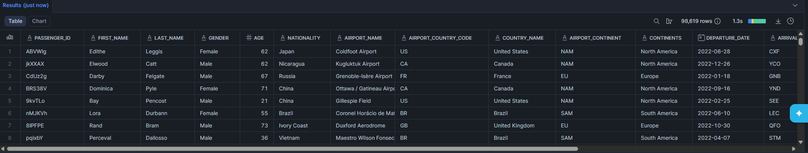

### Silver Layer
This layer is a cleaned copy of the dataset
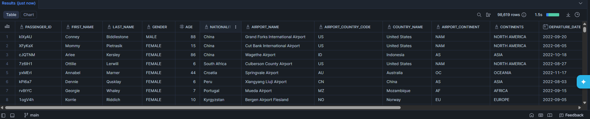

### Gold Layer
This layer introduces the star schema for easier reporting.
#### Fact_Flights Table
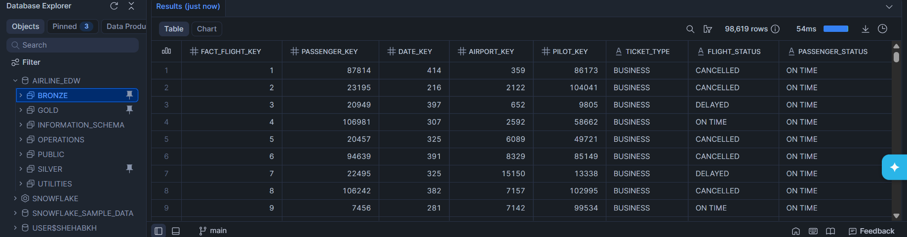

#### Dim_Passenger Table
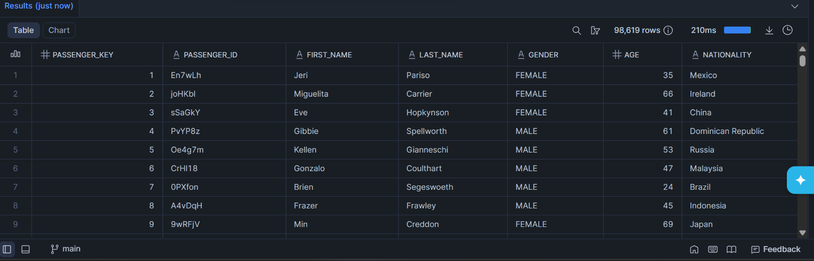

#### Dim_Airport Table
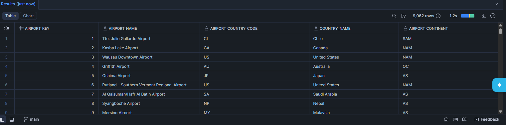

#### Dim_Pilot Table
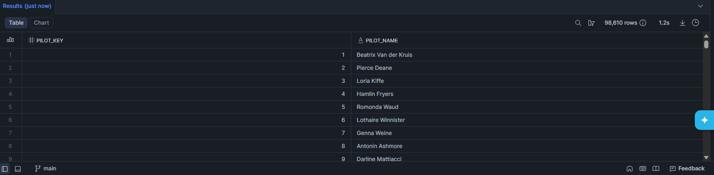

#### Dim_Date Table
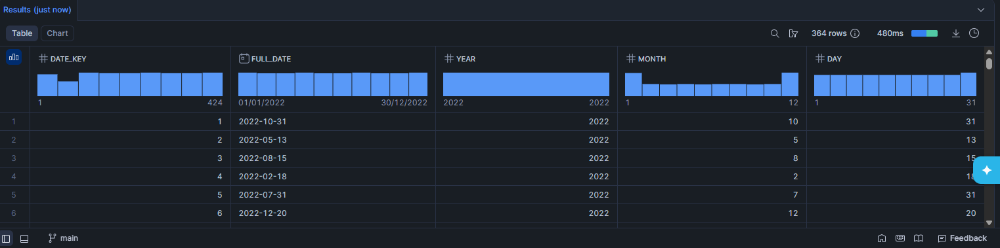

### Row Level Security Policy on Secure view based on fact table
#### ACCOUNTADMIN/SYSADMIN ROLE
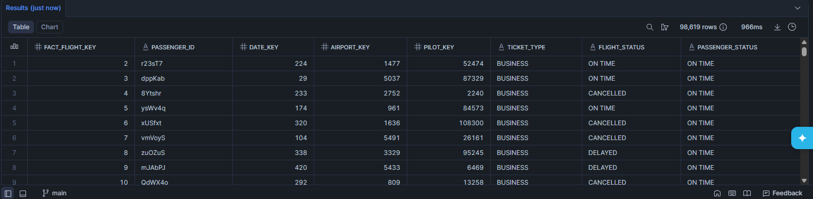
#### GENERAL_ANALYST ROLE
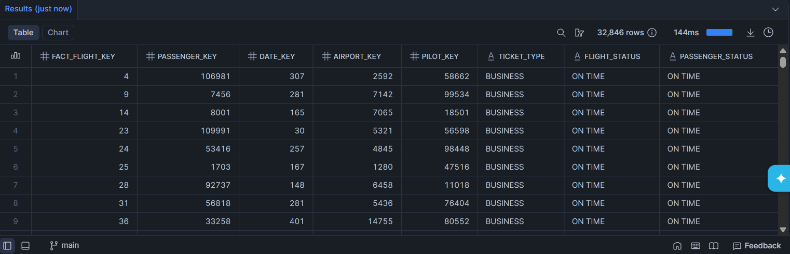
#### OPS_ANALYST ROLE
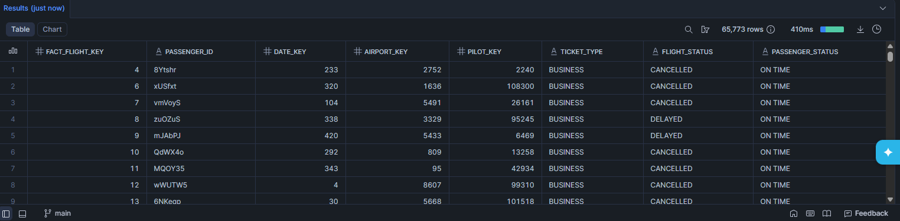
